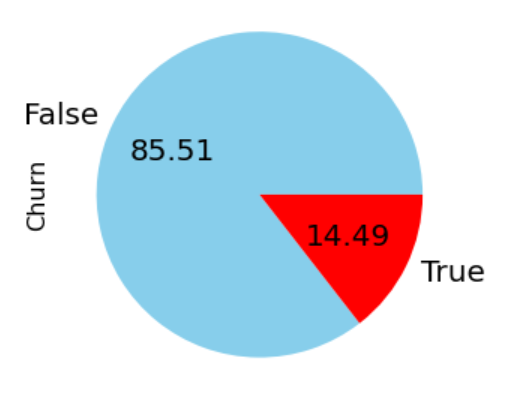
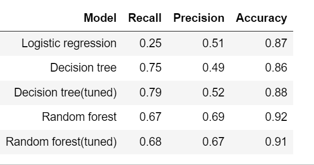
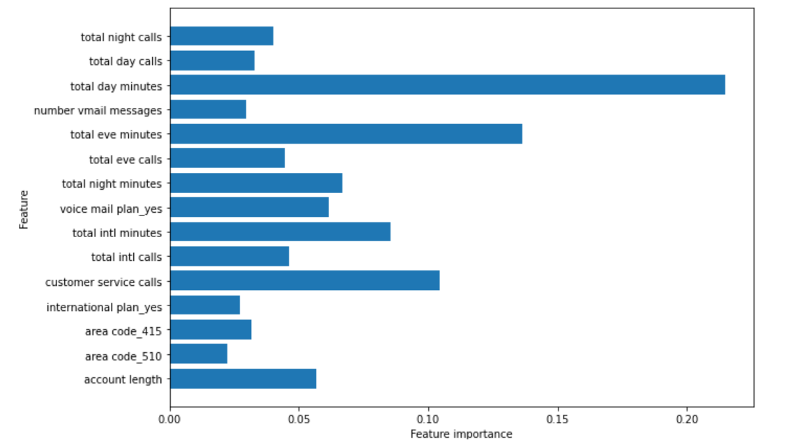

# SYRIATEL CUSTOMER CHURN
Author: Scholar Chepkirui

## Project overview
This project uses machine learning algorithms to build a model that can accurately predict customers who will churn based on the information available in the dataset. The dataset has 20 predictor variables mostly about customer usage patterns. The target variable is 'churn'. Since the target variable is a categorical variable, classification algorithms are used to build the predictive model. Recall is used to evaluate the model's performance.

## Business problem¶
For telecommunication companies to grow their revenue generating base, it is key to attract new customers and at the same time increase customer retention rate. Syriatel is a provider of mobile telecommunication and data services based in Damascus, Syria. It has established that long-term relationships with customers are more effective than trying to attract new customers. Churn prediction has therefore become a very important part of the company's strategy. This project aims to develop a model which accurately predicts customers who are most likely to churn, and identify the features that are important for predicting customer churn. Syriatel can thus act to prevent the customer who is likely to churn from actually churning.

## Exploratory data analysis
There is a class imbalance problem since the target class has an uneven distribution of observations. 85.51% of the data belongs to the False class while 14.49% belongs to the true class.

The scaling differs across the features, and a few of the features are not normally distributed. The features will therefore have to be scaled and normalized.

There is a very low correlation between most features.However, there is a perfect positive correlation between total charge and total minutes at different times. This is expected since the charge of a call depends on the length of the call in minutes. 
total day minutes, total day charge and customer service calls have a weak positive correlation with churn. The other features have a negligible correlation with churn, approximately 0.

## Data preparation for Machine Learning
- Multicollinearity of features: columns showing total charge at different times are dropped to address the multicollinearity 
- Train-test split: Data is split into train and test sets. 
- Transform categorical variables: dummy variables are created for categorical features. 
- SMOTE: SMOTE is used to handle class imbalance problems by oversampling the minority class with replacement. 
The pie chart below shows the distribution of target variable after applying SMOTE. 

## Modeling
Various models are created using logistic regression, decision tree and random forest algorithms. Hyperparameter tuning is applied to ldecision tree and random forest algorithms. 
A pipeline is used to prevent data leakage. Data is scaled in the pipeline. 
The image below shows a summary of the models and their performance.

## Evaluation
Decision tree with tuned hyperparameters is the model with the best performance. It has the highest recall score. The accuracy and precision scores are above average. 
However, the recall score achieved is below the set score of at least 85%. 
The feature importance of the best model is shown below.

## Conclusions and recommendations
The final model that will be used to predict customer churn is the decision tree with tuned hyperparameters.This model results in the lowest number of false negatives.
The most important features for predicting customer churn are:
- total day minutes: total number of minutes the customer has been in calls during the day
- total evening minutes: total number of minutes the customer has been in calls during the evening
- customer service calls: number of calls the customer has made to customer service
- total international minutes: total number of minutes the user has been in international calls
Syriatel should ensure effective customer service so as to meet customers' expectations and analyze customer interactions. They can then follow up on both positive and negative feedbacks received. 
The more the number of minutes the customer spends on the phone, the higher the likelihood of not churning. The company should look into the call charge rates in comparison to the competitors, and consider if they should lower the charges of calls per minute. This can prevent other customers from churning.

## Next steps
The targeted recall score of 85% is not achieved by the best performing model. There is still some overfitting in the model irregardless of hyperparameter tuning.
The training data size should be increased to reduce overfitting and hence improve model performance.

##  For More Information
See the full analysis in the [Jupyter Notebook](https://github.com/Scholarchep/Syriatel-customer-churn/blob/main/customer_churn.ipynb) or review this [presentation](https://github.com/Scholarchep/Syriatel-customer-churn/blob/main/presentation.pdf)
.
For additional information, contact Scholar Chepkirui at scholarchepkirui@gmail.com

## Repository Structure
<<<<<<< HEAD

├── Images                                    <- Both sourced externally and generated from code
├── Data                                      <- Both sourced externally and generated from code
├── README.md                                 <- The top-level README for reviewers of this project
├── presentation.pdf                          <- PDF version of project presentation
└── customer_churn.ipynb                      <- Narrative documentation of analysis in Jupyter notebook

